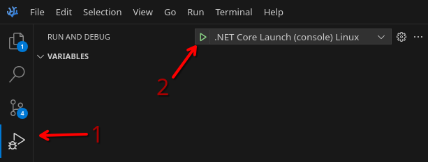

# Development Environment Setup using Nix or Nix Flakes on Linux x86_64
[Nix flakes](https://nixos.wiki/wiki/Flakes) can be used to provide version controlled reproducible and cross-platform development environments. The key files are:
- `flake.nix`: Defines the flake inputs and outputs, including development shells.
- `shell.nix`: This file defines the dependencies and additionally adds support for the Impure `nix-shell` method. This is used by the flake to create the dev environment.
- `flake.lock`: Locks the versions of inputs for reproducibility.
---
## Prerequisites
- [Nix](https://nixos.org/download.html) the package manager or NixOs installed on Linux (x86_64-linux)
- Optional: flakes support enabled. 
---
## Using the Development Shell
You have two primary ways to enter the development shell with Nix:
### 1. Using `nix develop` (flake-native command)
This is the recommended way if you have Nix with flakes support. Flake guarantee the versions of the dependencies and can be controlled through `flake.nix` and `flake.lock`.
```
nix develop
```
This will open a shell with all dependencies and environment configured as per the `flake.nix` for (`x86_64-linux`) systems only at this time.

---
### 2. Using `nix-shell` (that's why shell.nix is a separate file)
If you want to use traditional `nix-shell` tooling which uses the nixpkgs version of your system:
```
nix-shell
```
This will drop you into the shell environment defined in `shell.nix`. Note that this is not flake-native method and does not use the locked nixpkgs in `flake.lock` so exact versions of the dependancies is not guaranteed.

---
## What’s inside the dev shell?
- The environment variables and packages configured in `shell.nix` will be available.
- The package set (`pkgs`) used aligns with the versions locked in `flake.lock` to ensure reproducibility.

---
## Example Workflow using flakes
```
# Navigate to the project root folder which contains the flake.nix, flake.lock and shell.nix files.
cd /home/user/dev/Libation
# Enter the flake development shell (Linux x86_64)
nix develop
# run VSCode or VSCodium from the current shell environment
code .
# Run or Debug using VSCode and VSCodium using the linux Launch configuration.
```


You can also Build and run your application inside the shell.
``` 
dotnet build ./Source/LibationAvalonia/LibationAvalonia.csproj -p:TargetFrameworks=net9.0 -p:TargetFramework=net9.0 -p:RuntimeIdentifier=linux-x64
```

---

## Notes
- Leaving the current shell environemnt will drop all added dependancies and you will not be able to run or debug the program unless your system has those dependancies defined globally.
- To exit the shell environment voluntarily use `exit` inside the shell.
- Ensure you have no conflicting `nix.conf` or `global.json` that might affect SDK versions or runtime identifiers.
- Keep your `flake.lock` file committed to ensure builds are reproducible for all collaborators.

---
## References

- [Nix Flakes - NixOS Wiki](https://nixos.wiki/wiki/Flakes)
- [Nix.dev - Introduction to Nix flakes](https://nix.dev/manual/nix/2.28/command-ref/new-cli/nix3-flake-init)
- [Nix-shell Manual](https://nixos.org/manual/nix/stable/command-ref/nix-shell.html)
